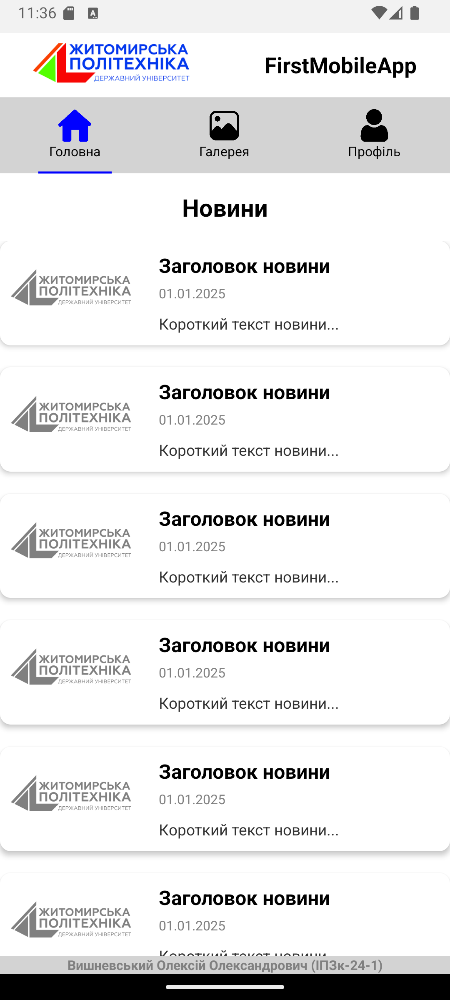
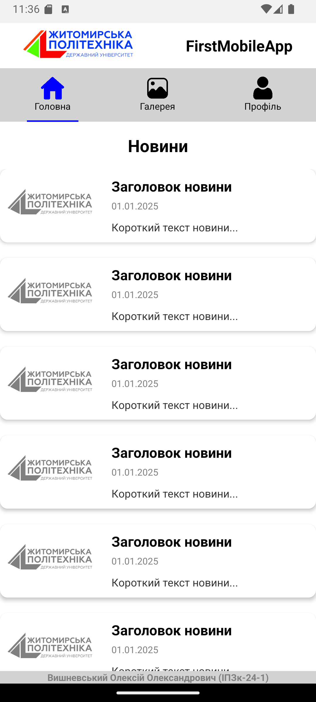
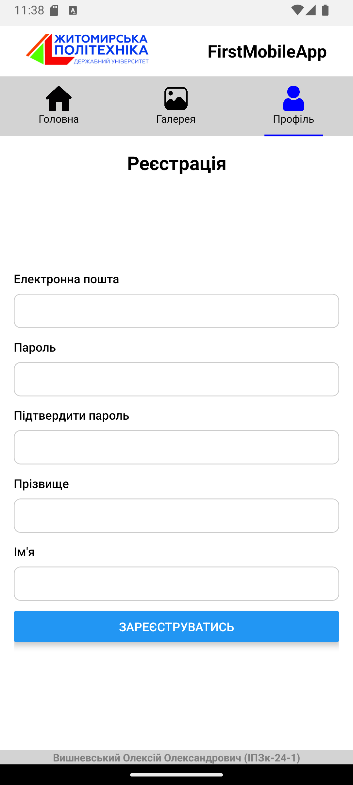

# Лабораторна 1

## Інструкція з запуску

1. Встановіть залежності:

   ```
   npm install
   ```

2. Запустіть додаток:

   ```
   npm start
   ```

   або для запуску на Android:

   ```
   npm run android
   ```

   або для запуску на iOS:

   ```
   npm run ios
   ```

   або для запуску у браузері:

   ```
   npm run web
   ```

3. Відскануйте QR-код у Expo Go або відкрийте додаток на емуляторі.

---

# Скріншоти




